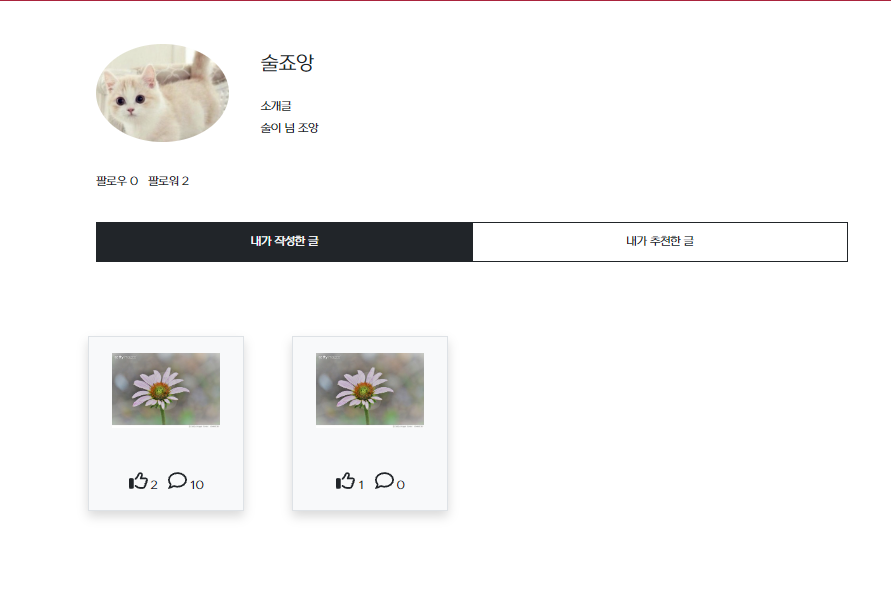

# 술을 좋아하는 사람들의 커뮤니티 사이트
## 프로젝트 소개
- 술을 좋아하는 사람들을 위한 커뮤니티 게시판

## 작업 기간 (2023.01 ~ 2023.04)

## 커밋 로그
https://github.com/Maswillaeng/MSL-backend/commits/YunByungil-backup

## 팀원
|역할|이름|
|---|---|
|프론트엔드|신동민|
|백엔드|윤병일|

## 기술 스택

  

### 프론트엔드
- React
- Javascript

### 백엔드
- Java: 11
- Spring Boot: 2.7.7
- Spring Security
- Spring Data JPA
- QueryDsl
- Build: Gradle
- Test: Postman
- DB: MySQL
- IDE: Intellij IDEA

### 협업
- Git
- Notion
- Discord

### 인프라
- S3

## ERD

### 주요 기능

- 인증 / 인가
    - 회원가입
    - JWT 사용
    - Spring Security 사용
- 유저
    - 정보 수정
- 게시판
    - 게시글 등록, 수정, 삭제
    - 카테고리별 조회
- 좋아요
    - 게시글 좋아요 입력, 취소
    - 댓글 좋아요, 싫어요 입력, 취소
- 댓글
    - 댓글 입력, 수정, 삭제
    - 대댓글 입력, 수정, 삭제
- 해시태그
    - 게시글 등록 시 해시태그 등록

## 페이지

  
### 마이페이지  

  

  

### 회원 정보 수정(S3를 이용한 이미지 업로드)  
  

적용 화면  
  

  

### 게시글 작성

  

  

### 해시태그

  

### 게시글 검색(작성자, 댓글, 제목, 글 내용)

    

  
  
  
### 댓글, 대댓글 작성

  

  
  
### 댓글 좋아요, 싫어요

  

  
  
### 게시글 좋아요, 회원 팔로우
  
  

  
  
  

